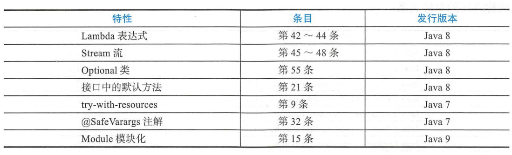

[TOC]

# 第一章 引言

-   [EffectiveJava3.0中文版在线阅读](https://sjsdfg.github.io/effective-java-3rd-chinese) 加群有pdf版
-   [EffectiveJava3.0源代码](https://github.com/jbloch/effective-java-3e-source-code)
-   本书目标：更有效地使用Java编程语言及其基本类库java.lang、java.util和java.io，以及子包java.util.concurrent和java.util.function等。
-   一共90个条目，每个条目讨论一条规则。每个条目都有一定程度的独立性，条目相互之间经常交叉引用
    
-   包含许多用来说明 **设计模式（Design Pattern）和习惯用法（Idiom）** 的代码示例，也包含有一个或多个应该在实践中 **避免** 的程序示例-“反模式”（Antipattern），在注释中清楚地标注为"/Never do this！"。
-   本书不是针对初学者的
-   本书中使用的术语“组件"（Component），是指任何可重用的软件元素，从单个方法，到包含多个包的复杂框架，都可以是一个组件
    -   清晰性和简洁性最为重要：组件的用户永远也不应该被其行为所迷惑
    -   代码应该被重用，而不是被拷贝。组件之间的依赖性应该尽可能地降到最小。错误应该尽早被检测出来，最好是在编译时就发现并解决
-   本书大部分内容都不是讨论性能的，而是关心如何编写出清晰、正确、可用、健壮、灵活和可维护的程序来
-   [本书的Web站点](http://joshbloch.com/effectivejava)提供了每个示例的完整版本
-   本书采用的大部分技术术语都与《The Java Language Specification，Java SE 8 Edition》[JLS]相同
-   章节简介
    > 第1章为引言。
    > 第2章阐述何时以及如何创建对象，何时以及如何避免创建对象，如何确保它们能够适时地销毁，以及如何管理对象销毁之前必须进行的各种清除动作。
    > 第3章阐述对于所有对象都通用的方法，你会从中获知对equals，hashCode，tostring，clone，finalize以及Comparable.compareTo方法相当深人的分析，从而避免今后在这些问题上再次犯错
    > 第4章阐述作为Java程序设计语言的核心以及Java语言的基本抽象单元（类和接口）在使用上的一些指导原则，帮助你更好地利用这些元素，设计出更加有用、健壮和灵活的类与接口。
    > 第5章和第6章中分别阐述在Java 1.5发行版本中新增加的泛型（Generic）以及枚举Enum）和注解（Annotation）的最佳实践，教你如何最大限度地享有这些优势，并使整个过程尽可能地简单化。
    > 第7章专门讨论在Java 8中新增的函数接口（Functional Interface），Lambda表达式和方法引用（Method Reference），使创建函数对象（Function Object）变得更加容易。接着探讨为处理数据元素的序列提供了类库级别支持的Stream API，以及如何最佳地利用这些机制。
    > 第8章讨论方法设计的几个方面：如何处理参数和返回值，如何设计方法签名，如何为方法编写文档，从而使方法设计在可用性、健壮性和灵活性上有进一步的提升。
    > 第9章主要讨论Java语言的具体细节，讨论了局部变量的处理、控制结构、类库的使用、各种数据类型的用法，以及两种不是由语言本身提供的机制（Reffection 和Native Method，反射机制和本地方法）的用法，并讨论了优化和命名惯例。
    > 第10章阐述如何充分发挥异常的优点来提高程序的可读性、可靠性和可维护性，以及减少异常使用不当所带来的负面影响，并提供了一些关于有效使用异常的指导原则第11章阐述如何帮助你编写出清晰、正确、文档组织良好的并发程序，比如如何避免过度同步，优先采用Executor Framework、并发集合（Concurrent Collection）同步器（Synchronizer），以及是否需要依赖于线程调度器等。
    > 第12章阐述序列化方面的技术，并且有一项值得特别提及的特性，就是序列化代理（Serialization Proxy）模3助你避免对象序列化的许多缺陷
